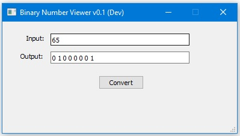

# Binary Number Viewer

**Binary Number Viewer** is a *C++ (Qt)* desktop application that allows you to convert and manipulate binary numbers.

---

### Capabilities

* Convert from decimal number to binary number.

----

### Version History

**Version 0.1**
* This version is fully usable.
* Cant read any decimal number in the range 0 - 255 (1 byte) and convert to binary.
